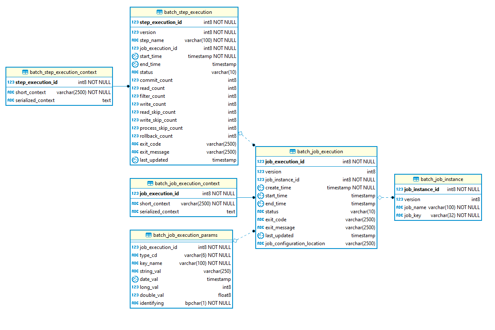

# formation-spring-batch

## Présentation

Projet de formation à Spring Batch.

Les étapes de formations :
 - Initialisation du projet
 - Step 00 - Initialisation du batch

## Initialisation du projet 

L'initialisation du projet est possible via [Spring Initializr](https://start.spring.io/).

Les éléments sélectionnés sont :
- Projet : "Maven Project"
- Langage : Java
- Spring Boot (Version) : 2.4.4 
- Project Metadat :
  - Group : com.sopra
  - Artifact : formation-spring-batch
  - Name : formation-spring-batch
  - Description : Demo project for Spring Batch
  - Package Name : com.sopra.formationspringbatch
  - Packaging : jar
  - Java : 8
    
## Step 00 - Initialisation du batch

Dans notre cas l'initialisation du bath correspond à :
- L'ajout de la [Classe de configuration](src/main/java/com/sopra/formationspringbatch/config/BatchConfiguration.java), où l'on retrouve les annotations
  - @Configuration sur la classe qui contient les @Bean, afin d’indiquer à Spring que, lors du scan, il y a des Beans
    dans cette classe.
  - @EnableBatchProcessing sur la classe comme une qui va permettre de créer et configurer des composants Spring Batch.
- Dans la classe de [boot](src/main/java/com/sopra/formationspringbatch/config/BatchConfiguration.java), on ajoute les
  éléments suivants :
  - @SpringBootApplication(exclude = {DataSourceAutoConfiguration.class}) pour exclure la gestion automatique de base de
    données (ici on n'en a aucune)
  - @ComponentScan({"com.sopra.formationspringbatch"}), dans le but de définir le package racine contenant les
    différents composants, configuration ect. utiles à Spring.
  - @EnableConfigurationProperties : Pour la prise en compte
    du [fichier de configuration](src/main/resources/application.yml)
- Les propriétés de configuration (Outre le nom de l'application et l'affichage de la bannière dans la console) :
  - **initialize-schema** : définit si les tables techniques Spring Batch sont initialisées au démarrage.

## Step 01 - Configuration de la base de données

Pour cette étape, nous configurons le batch pour qu'il soit interfacé sur une BDD PostgreSQL.

- Les dépendances
  - On ajoute la dépendance PostgreSQL avec la version postgreSQL compatible à la version associée à celel de Spring
    Boot
- Les propriétés de configuration (Outre le nom de l'application et l'affichage de la bannière dans la console) :
  - **initialize-schema** : On change la valeur never à always pour que le schéma soit initialisé avec les tables
    techniques Spring Batch _ **datasource** : on y saisit le login, le mot de passe l'URL de connexion et le driver de
    connexion (ici PostgreSQL)
- Dans la classe de [boot](src/main/java/com/sopra/formationspringbatch/config/BatchConfiguration.java), on supprime
  l'élément suivant :
  - "exclude = {DataSourceAutoConfiguration.class}" pour inclure la gestion automatique de base de données, dans
    l'annotation @SpringBootApplication.

Après execution du batch, on obtient le modèle de données suivant

<details>
<summary>MCD Batch</summary>

</details>

## Build & exécution

### Build (Local)

```bash
mvn clean install
```

### Execution du batch (Local)

```bash
cd eox-rtot-boot
mvn spring-boot:run
```